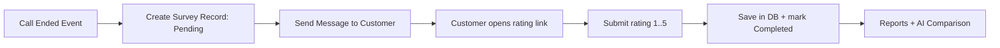

# Post-Call Customer Rating (1–5) — Tasks & Specs
> Module: Customer Survey after call end (CSAT 1–5)
> Question: **"Was your request handled successfully? Rate 1–5."**
> Output: Store rating in DB linked to `callId` and available for reporting + comparison with AI scores.

---

## Message to the Team (short)
Please implement a **post-call customer rating** flow that triggers **after the call ends**, sends the customer a short message with a **secure rating link**, and stores the **1–5 rating** in the database linked to the call.

**Arabic version (اختياري):**  
مطلوب تنفيذ تقييم بعد انتهاء المكالمة: إرسال رسالة للعميل بعد نهاية المكالمة مباشرة تحتوي لينك تقييم من **1 إلى 5** على سؤال: **هل تم معالجة طلبك بنجاح؟** ثم حفظ التقييم في قاعدة البيانات مرتبط بـ `callId`.

---

## 1) Functional Flow



---

## 2) Business Rules (Defaults)
- One survey per call: **unique by `CallId`**
- Rating values: **1..5 only**
- Survey expiry: **24 hours** (configurable)
- Duplicate submits:
  - Default: **first submit wins** (idempotent)
- If customer contact is missing: mark as **NotEligible**
- If sending fails: mark **Failed**, retry policy applies

---

## 3) Database Design

### Table: `CallSurvey`
| Column | Type | Notes |
|---|---|---|
| `Id` | GUID/UUID | PK |
| `CallId` | string/GUID | **Unique** (1 survey per call) |
| `AgentId` | string (nullable) | recommended |
| `QueueId` | string (nullable) | recommended |
| `Direction` | string (nullable) | inbound/outbound |
| `CustomerContactMasked` | string (nullable) | masked/hashed if needed |
| `Channel` | string | SMS / WhatsApp / Email / IVR / Web |
| `QuestionCode` | string | `RESOLUTION_SUCCESS_1_5` |
| `Rating` | tinyint (nullable) | 1..5 (null until answered) |
| `Status` | string | Pending / Sent / Completed / Expired / Failed / NotEligible |
| `Token` | string | unique, random, URL-safe |
| `SentAt` | datetime (nullable) | |
| `RespondedAt` | datetime (nullable) | |
| `ExpiresAt` | datetime | |
| `ProviderMessageId` | string (nullable) | tracking |
| `CreatedAt` | datetime | |
| `UpdatedAt` | datetime | |

**Constraints**
- Unique index on `CallId`
- Unique index on `Token`
- Check constraint: `Rating BETWEEN 1 AND 5` (or validate in app)

> Optional: store rating also in Calls table as `Calls.CustomerRating` for faster reporting.

---

## 4) API Contract

### 4.1 Create survey (internal)
`POST /calls/{callId}/survey/create`

**Request (example)**
```json
{
  "agentId": "A-1001",
  "queueId": "Q-01",
  "direction": "inbound",
  "customerContact": "+966xxxxxxxxx",
  "channel": "SMS"
}
```

**Response**
```json
{
  "surveyId": "uuid",
  "callId": "123",
  "token": "secureToken",
  "status": "Pending",
  "expiresAt": "2025-12-20T10:00:00Z"
}
```

### 4.2 Get survey (public page load)
`GET /surveys/{token}`  
Returns survey state + question (for the web page).

### 4.3 Submit rating (public)
`POST /surveys/{token}/submit`

**Request**
```json
{ "rating": 5 }
```

**Response**
```json
{
  "callId": "123",
  "status": "Completed",
  "rating": 5,
  "respondedAt": "2025-12-19T09:55:00Z"
}
```

**Idempotency**
- If already Completed: return the stored rating (do not overwrite) unless policy says otherwise.

---

## 5) Message Template (Short)

### SMS / WhatsApp (Arabic)
> شكرًا لتواصلك معنا.  
> هل تم معالجة طلبك بنجاح؟ قيّم من 1 إلى 5:  
> {SurveyLink}

### SMS / WhatsApp (English)
> Thanks for contacting us.  
> Was your request handled successfully? Rate 1–5:  
> {SurveyLink}

---

## 6) Survey Web Page (UI Requirements)
- Simple page (mobile-first)
- Show the question + 5 buttons (1..5)
- Submit → show success message
- Handle states:
  - token invalid
  - expired
  - already submitted

---

## 7) Integration Points

### Triggering the Survey
- Preferred: listen to **Call Ended** event from Call Center
- Fallback: scheduled job checks calls ended in last X minutes and creates surveys

### Sending Layer
- Use existing message provider or integrate (SMS/WhatsApp)
- Queue the send action + retry with backoff

---

## 8) Tasks Breakdown (Backlog)

### Backend (Core)
- [ ] Create DB migration for `CallSurvey` + indexes + constraints
- [ ] Implement create-survey logic on call-ended trigger
- [ ] Implement message sending service (queue + retry + store ProviderMessageId)
- [ ] Implement public endpoints: `GET /surveys/{token}` and `POST /surveys/{token}/submit`
- [ ] Validation: rating must be 1..5; token must be valid & not expired
- [ ] Idempotency: prevent double-submit overwrite (default: first submit wins)
- [ ] Update `CallSurvey.Status` transitions: Pending → Sent → Completed / Failed / Expired
- [ ] (Optional) store `Calls.CustomerRating` for reporting speed

### Frontend (Survey Page)
- [ ] Build `/survey/{token}` page (mobile-first)
- [ ] 5 rating buttons + submit
- [ ] states: success / invalid / expired / already completed
- [ ] minimal styling consistent with product

### Reporting / Analytics
- [ ] Report: avg rating by agent / queue / date range
- [ ] Report: correlation between customer rating (1..5) and AI CSAT score (0..100)

### QA
- [ ] Test cases: invalid token, expired token, rating outside range, duplicate submit
- [ ] Test sending failures and retries
- [ ] Confirm one-survey-per-call constraint

### Security / Privacy
- [ ] Token generation: cryptographically secure, random, non-guessable
- [ ] Do not expose customer PII in URL; store masked/hashed contact if needed
- [ ] Retention policy for survey records (configurable)

---

## 9) Definition of Done (DoD)
- [ ] After call end, a survey record is created and message is sent (or marked Failed with retries)
- [ ] Customer can submit rating 1..5 via link
- [ ] Rating is stored in DB linked to `callId`
- [ ] Duplicate submits behave per policy (default: first submit wins)
- [ ] Reporting endpoints/queries available for avg rating
